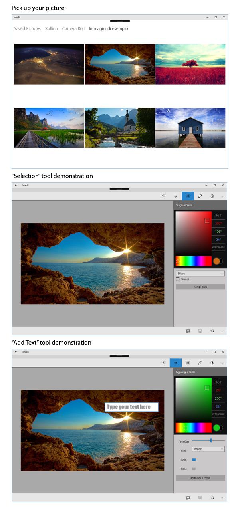

# Imedit

Imedit is an early stage Image Editor Windows 10 UWP app built to showcase the capabilities of Continuum APIs.
Imedit allows the user to take pictures while using their Windows 10 Mobile (Continuum capable) smartphone, and then connect it to a big screen for editing.

The app is of course capable of running as a standard Windows 10 Desktop app.

The app is fully localized in Italian and English.

Below here, a series of screenshots that show the content of the app:

## How is it built?

The app relies on the following plugins and extensions:

* ColorPicker
* LumiaImagingSDK.UWP
* Microsoft.NETCore.UniversalWindowsPlatform
* MvvmLight
* WindowsStateTriggers
* WinRTXamlToolkit
* WriteableBitmapEx